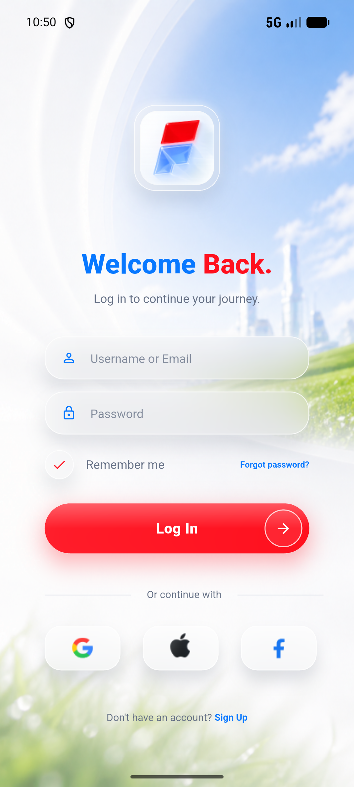
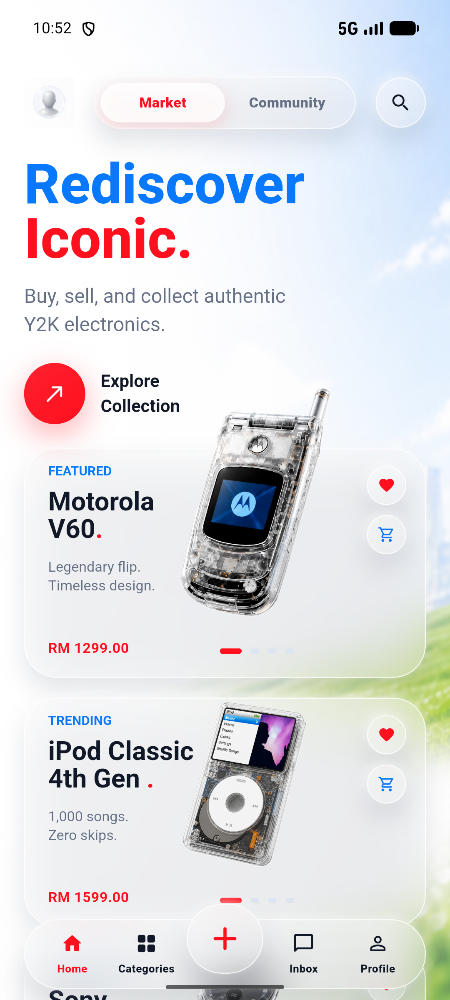
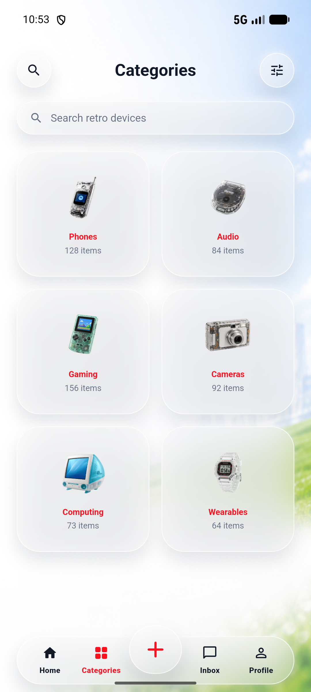
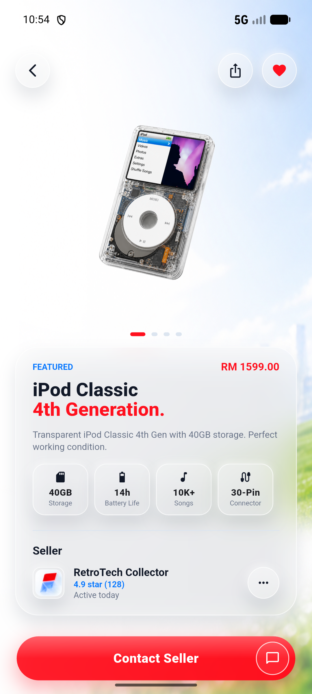
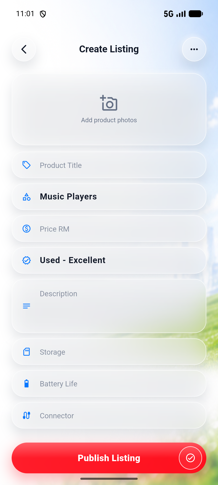
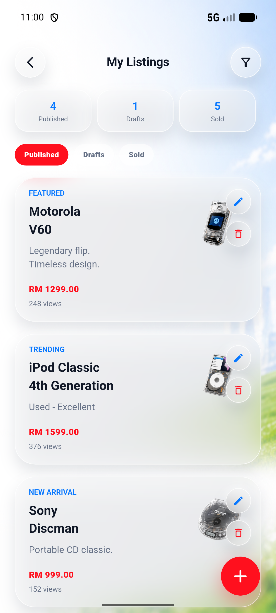

# RetroTech Marketplace

RetroTech Marketplace is a Flutter mobile app prototype for browsing, listing, and managing retro technology products. It includes authentication screens, product discovery, category browsing, listing management, chat, profile, settings, and help screens.

## Features

- Browse retro devices by category and view product details.
- Create, update, and delete marketplace listings.
- Manage profile, settings, messages, and support pages.
- Build automation for Android APK and unsigned iOS app artifacts through GitHub Actions.

## Screenshots

| Login | Home | Categories |
| --- | --- | --- |
|  |  |  |

| Product Detail | Create Listing | My Listings |
| --- | --- | --- |
|  |  |  |

## Tech Stack

- Flutter and Dart
- SQLite through `sqflite`
- Shared preferences for local state
- GitHub Actions for Android and iOS builds

## Run Locally

```bash
cd retro_tech_marketplace
flutter pub get
flutter run
```

## Build

```bash
cd retro_tech_marketplace
flutter build apk --release
flutter build ios --release --no-codesign
```

The iOS build artifact is unsigned and needs Apple signing before installation on a real device.
